# Проект: Система управления оффлайн-кинотеатром
Данный проект представляет собой веб-приложение для управления кинотеатром, которое включает функционал для работы с фильмами, залами, сеансами и билетами. Ниже представлена документация проекта, включающая описание структуры базы данных, основные классы на PHP и реализованные CRUD-операции.
---
## 1. Структура базы данных
Проект использует СУБД PostgreSQL. Ниже приведено описание структуры базы данных:
### Таблица: movies (Фильмы)


**Поля:**
- `id` (PRIMARY KEY)
- `title` (VARCHAR) — название фильма
- `duration` (TIME) — продолжительность
- `has_3d` (BOOLEAN) — поддержка 3D
- `price` (DECIMAL) — стоимость билета

### Таблица: auditoriums (Залы кинотеатра)

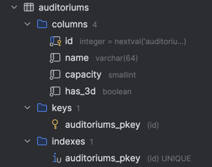

**Поля:**
- `id` (PRIMARY KEY)
- `name` (VARCHAR) — название зала
- `capacity` (INTEGER) — вместимость
- `has_3d` (BOOLEAN) — поддержка 3D

### Таблица: showings (Сеансы)

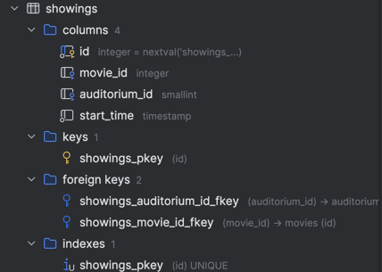

**Поля:**
- `id` (PRIMARY KEY)
- `movie_id` (FOREIGN KEY) — связь с таблицей movies
- `auditorium_id` (FOREIGN KEY) — связь с таблицей auditoriums
- `start_time` (TIMESTAMP) — время начала сеанса

### Таблица: tickets (Билеты)

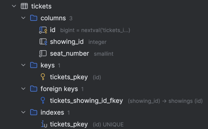

**Поля:**
- `id` (PRIMARY KEY)
- `showing_id` (FOREIGN KEY) — связь с таблицей showings
- `seat_number` (INTEGER) — номер места

### Таблица: administrators (Администраторы)

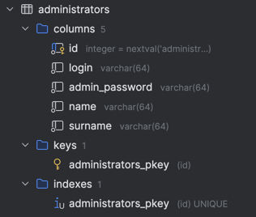

**Поля:**
- `id` (PRIMARY KEY)
- `login` (VARCHAR) — логин администратора
- `admin_password` (VARCHAR) — пароль администратора
- `name` (VARCHAR) — имя
- `surname` (VARCHAR) — фамилия

### Скриншот структуры базы данных
Ниже приведён пример скриншота, демонстрирующего общую схему базы данных:

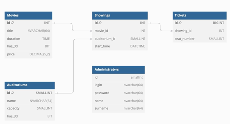
---
## 2. Основные классы на PHP
Проект построен на объектно-ориентированном подходе. Ниже описаны основные классы с их назначением и основными методами.
### DatabaseHandler
Главный класс для работы с базой данных. Он обеспечивает подключение к PostgreSQL через PDO и реализует CRUD-операции для различных сущностей.
```php
class DatabaseHandler {
    private $pdo;

    public function __construct($dsn, $user, $password) {
        try {
            $this->pdo = new PDO($dsn, $user, $password);
            $this->pdo->setAttribute(PDO::ATTR_ERRMODE, PDO::ERRMODE_EXCEPTION);
        } catch (PDOException $e) {
            die("Ошибка подключения к БД: " . $e->getMessage());
        }
    }

    // Методы для работы с фильмами
    public function getMovies() { /* ... */ }
    public function getMovieByID($id) { /* ... */ }
    public function deleteMovie($id) { /* ... */ }

    // Методы для работы с залами
    public function getAuditoriums() { /* ... */ }
    public function getAuditoriumByID($id) { /* ... */ }
    public function deleteAuditorium($id) { /* ... */ }

    // Методы для работы с сеансами
    public function getShowings() { /* ... */ }
    public function getShowingsByMovie($movie_id) { /* ... */ }
    public function getShowingsByAuditorium($auditorium_id) { /* ... */ }
    public function getShowingByID($id) { /* ... */ }
    public function deleteShowing($id) { /* ... */ }

    // Методы для работы с билетами
    public function getTickets() { /* ... */ }
    public function getTicketsByShowing($showing_id) { /* ... */ }
    public function deleteTicket($id) { /* ... */ }
}
```
### Movie
Класс, отвечающий за данные о фильмах. Содержит свойства, соответствующие полям таблицы movies, и методы для работы с сеансами и сохранения в БД.

```php
class Movie {
    public $id;
    public $title;
    public $duration;
    public $has_3d;
    public $price;

    public function __construct($id = null, $title, $duration, $has_3d, $price) {
        $this->id = $id;
        $this->title = $title;
        $this->duration = $duration;
        $this->has_3d = $has_3d;
        $this->price = $price;
    }

    public function getShowings($pdo) {
        // Реализует получение всех сеансов, связанных с этим фильмом
    }

    public function save($pdo) {
        // Реализует сохранение или обновление фильма в базе данных
    }
}
```
### Auditorium
Класс для работы с залами кинотеатра.

```php
class Auditorium {
    public $id;
    public $name;
    public $capacity;
    public $has_3d;
    public function __construct($id = null, $name, $capacity, $has_3d) {
        $this->id = $id;
        $this->name = $name;
        $this->capacity = $capacity;
        $this->has_3d = $has_3d;
    }
    public function getShowings($pdo) {
        // Реализация получения сеансов для данного зала
    }
    public function save($pdo) {
        // Реализация сохранения или обновления информации о зале
    }
}
```

### Showing
Класс, отвечающий за сеансы.
```php
class Showing {
    public $id;
    public $movie_id;
    public $auditorium_id;
    public $start_time;
    public function __construct($id = null, $movie_id, $auditorium_id, $start_time) {
        $this->id = $id;
        $this->movie_id = $movie_id;
        $this->auditorium_id = $auditorium_id;
        $this->start_time = $start_time;
    }
    public function getMovie($pdo) {
        // Получение данных фильма для данного сеанса
    }
    public function getAuditorium($pdo) {
        // Получение данных зала для данного сеанса
    }
    public function getTickets($pdo) {
        // Получение билетов для данного сеанса
    }
    public function save($pdo) {
        // Сохранение или обновление информации о сеансе
    }
}
```

### Ticket

Класс для работы с билетами.

```php
class Ticket {
    public $id;
    public $showing_id;
    public $seat_number;

    public function __construct($id = null, $showing_id, $seat_number) {
        $this->id = $id;
        $this->showing_id = $showing_id;
        $this->seat_number = $seat_number;
    }

    public function save($pdo) {
        // Сохранение билета в базу данных
    }
}
```
---
## 3. Реализованные CRUD-операции

### Фильмы 
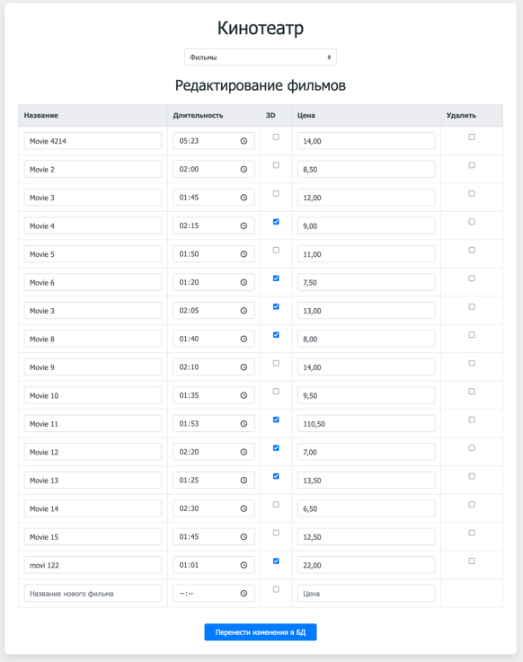  
- **Read (Чтение)**: Выводятся фильмы по строкам с наименованием, длительностью, наличием 3D, ценой за билет
- **Delete (Удаление)**: Справа от соответствующей строки есть чекбокс **Удалить**, нажав на который соответствующий фильм будет помечен для удаления
- **Create (Создание)**: Для создания нового фильма снизу на странице есть дополнительная строка, в которой можно задать соответствующие поля для нового фильма
- **Update (Обновление)**: Для обновления необходимо выбрать строку, изменить в ней необходимые данные.

Примечание: При внесении всех изменений они сначала сохраняются локально, а переносятся в БД только по нажатии на кнопку **Перенести изменения в БД**

### Аудитории (Кинозалы) 
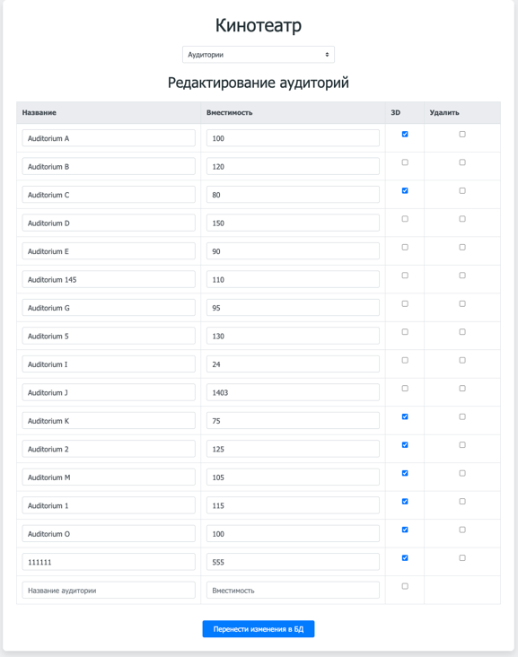  
- **Read (Чтение)**: Выводятся кинозалы по строкам с наименованием, вместимостью, наличием 3D.
- **Delete (Удаление)**: Справа от соответствующей строки есть чекбокс **Удалить**, нажав на который соответствующий кинозал будет помечен для удаления.
- **Create (Создание)**: Для создания нового кинозала снизу на странице есть дополнительная строка, в которой можно задать соответствующие поля для нового кинозала.
- **Update (Обновление)**: Для обновления необходимо выбрать строку, изменить в ней необходимые данные.

Примечание: При внесении всех изменений они сначала сохраняются локально, а переносятся в БД только по нажатии на кнопку **Перенести изменения в БД**

### Показы
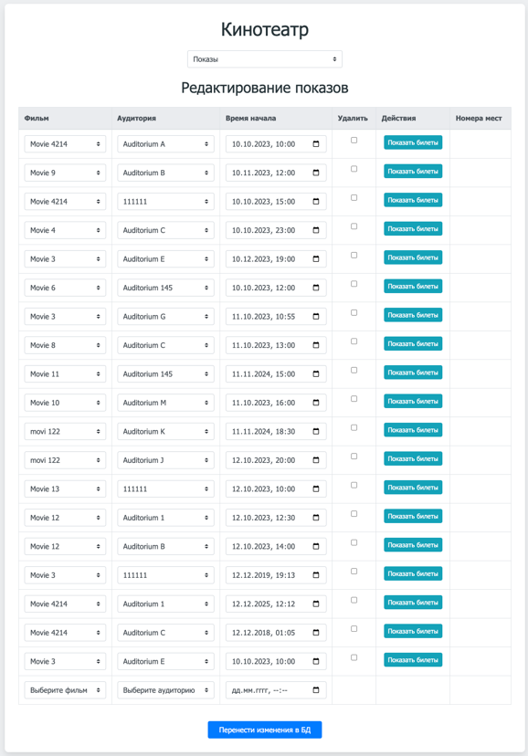  
- **Read (Чтение)**: Выводятся показы по строкам с наименованием фильма, кинозалом, временем начала.
- **Delete (Удаление)**: Справа от соответствующей строки есть чекбокс **Удалить**, нажав на который соответствующий показ будет помечен для удаления
- **Create (Создание)**: Для создания нового показа снизу на странице есть дополнительная строка, в которой можно задать соответствующие поля для нового фильма
- **Update (Обновление): Для обновления необходимо выбрать строку, изменить в ней необходимые данные. Внешние ключи реализованы через вывод соответствующих значений из таблиц с использованием комбобоксов

Примечание: При внесении всех изменений они сначала сохраняются локально, а переносятся в БД только по нажатии на кнопку **Перенести изменения в БД**

### Билеты 
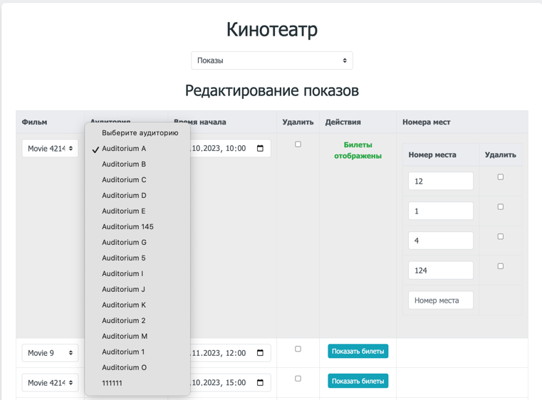  
- **Read (Чтение)**: Выводятся билеты по строкам с показами, для этого рядом с показом создана отдельный столбец с возможностью вывода билетов по соответствующему показу.
- **Delete (Удаление)**: Справа от соответствующей строки есть чекбокс **Удалить**, нажав на который соответствующий билет будет помечен для удаления
- **Create (Создание)**: Для создания нового билета снизу соответствующией строки есть дополнительная строка, в которой можно задать номер билета для выбранного показа
- **Update (Обновление)**: Для обновления необходимо выбрать строку, изменить в ней необходимые данные.

Примечание: При внесении всех изменений они сначала сохраняются локально, а переносятся в БД только по нажатии на кнопку **Перенести изменения в БД**

---
## 4. Технологии
- **Язык программирования:** PHP (включая ООП)
- **СУБД:** PostgreSQL
- **Библиотека доступа к БД:** PDO
- **Фронтенд:** HTML, CSS, Bootstrap
---

## 5. Авторизация и безопасность

### 🔐 Авторизация пользователя

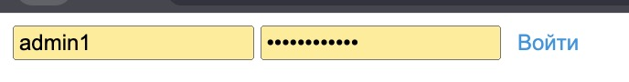

Для защиты доступа к страницам веб-интерфейса реализована система авторизации. Все защищённые страницы подключают следующий файл:

```php
require_once __DIR__ . '/../src/auth/require_admin.php';
$admin = AuthService::admin();
```

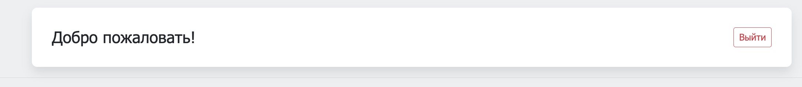

Если пользователь не авторизован, происходит перенаправление на страницу входа. В сессии хранится информация об авторизованном пользователе.

---

### 🔐 Хэширование пароля

Пароли хранятся в зашифрованном виде:

```php
$passwordHash = password_hash($password, PASSWORD_DEFAULT);
```

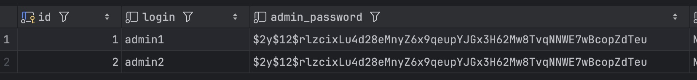

Проверка пароля при авторизации:

```php
password_verify($inputPassword, $storedHash);
```

---

### 🛡️ Валидация данных и защита от инъекций

Используется класс `Validator` для проверки и очистки всех пользовательских данных на стороне сервера.

#### ✅ Примеры валидации и очистки:

**Очистка строк:**
```php
public static function sanitizeString($input): string {
    $input = trim($input);
    $input = strip_tags($input);
    $input = htmlspecialchars($input, ENT_QUOTES | ENT_SUBSTITUTE, 'UTF-8');
    $input = str_ireplace([...], '', $input); // фильтрация SQL-ключевых слов
    return $input;
}
```

**Проверка даты/времени:**


```php
public static function isValidDateTime(string $datetime): bool {
    $formats = ['Y-m-d\TH:i', 'Y-m-d H:i'];
    foreach ($formats as $format) {
        $dt = DateTime::createFromFormat($format, $datetime);
        if ($dt && empty(DateTime::getLastErrors()['error_count'])) {
            return (int)$dt->format('Y') >= (int)date('Y');
        }
    }
    return false;
}
```

**Проверка чисел и флагов:**
```php
public static function isValidNumber($value): bool {
    return is_numeric($value) && $value >= 0;
}

public static function isValidCheckbox($value): bool {
    return in_array($value, ['0', '1', 0, 1, true, false], true);
}
```

---

### 🚫 Защита от некорректного удаления связанных данных

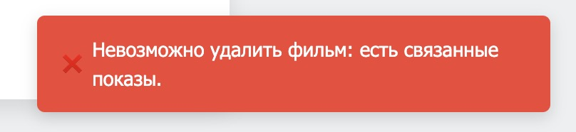

```php
public static function canDeleteRecord(PDO $pdo, string $table, int $id): bool {
    switch ($table) {
        case 'movies':
            $stmt = $pdo->prepare("SELECT COUNT(*) FROM showings WHERE movie_id = :id");
            break;
        case 'auditoriums':
            $stmt = $pdo->prepare("SELECT COUNT(*) FROM showings WHERE auditorium_id = :id");
            break;
        case 'showings':
            $stmt = $pdo->prepare("SELECT COUNT(*) FROM tickets WHERE showing_id = :id");
            break;
        default:
            return true;
    }

    $stmt->execute(['id' => $id]);
    return $stmt->fetchColumn() == 0;
}
```

---

### 🔒 Защита от подмены адресов

Допустимые значения для параметра `table` контролируются явно:

```php
$allowedTables = ['movies', 'auditoriums', 'showings', 'tickets', 'report_hall_stats', 'report_film_tickets', 'report_film_stats'];
if (!in_array($table, $allowedTables, true)) {
    header('Location: ' . $_SERVER['PHP_SELF'] . '?table=movies');
    exit;
}
```

---

## 6. Отчётность

Система содержит три отчётных модуля с отображением в таблице и возможностью выгрузки в файлы Excel/Word.

---

### 📋 Список билетов на фильм


Метод для генерации отчета по всем билетам на фильм:

```php
public function ReportTicketsForFilm(int $filmId): array {
    $sql = "
    SELECT 
        t.seat_number AS \"Место\",
        s.start_time AS \"Время показа\",
        a.name AS \"Кинозал\"
    FROM \"tickets\" t
    JOIN \"showings\" s ON t.showing_id = s.id
    JOIN \"movies\" m ON s.movie_id = m.id
    JOIN \"auditoriums\" a ON s.auditorium_id = a.id
    WHERE m.id = :filmId
    ORDER BY s.start_time
    ";
    $stmt = $this->pdo->prepare($sql);
    $stmt->execute(['filmId' => $filmId]);
    return $stmt->fetchAll(\PDO::FETCH_ASSOC);
}
```

---

### 📊 Статистика по фильмам

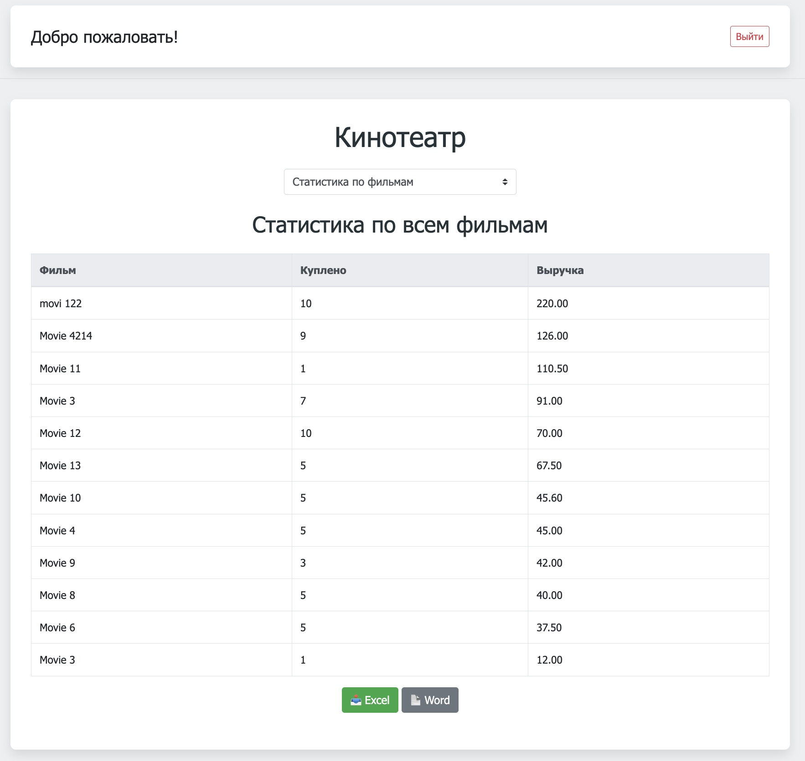


Агрегированный отчёт по фильмам:

```php
public function ReportStatsForAllFilms(): array {
    $sql = "
    SELECT 
        m.title AS \"Фильм\",
        COUNT(t.id) AS \"Куплено\",
        COUNT(t.id) * m.price AS \"Выручка\"
    FROM \"tickets\" t
    JOIN \"showings\" s ON t.showing_id = s.id
    JOIN \"movies\" m ON s.movie_id = m.id
    GROUP BY m.id, m.title, m.price
    ORDER BY \"Выручка\" DESC
    ";
    $stmt = $this->pdo->query($sql);
    return $stmt->fetchAll(\PDO::FETCH_ASSOC);
}
```

---

### 🏟️ Статистика по залам

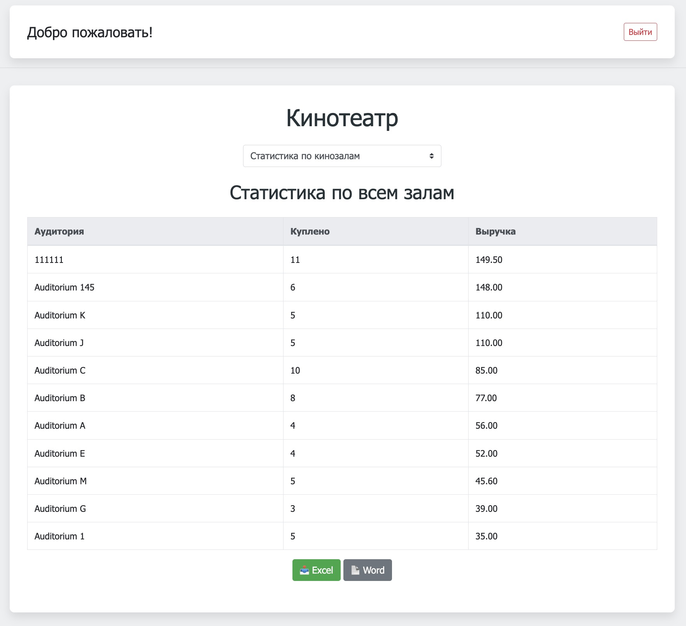

Отчёт по загруженности и доходности залов:

```php
public function ReportStatsForAllHalls(): array {
    $sql = "
    SELECT 
        a.name AS \"Аудитория\",
        COUNT(t.id) AS \"Куплено\",
        SUM(m.price) AS \"Выручка\"
    FROM \"tickets\" t
    JOIN \"showings\" s ON t.showing_id = s.id
    JOIN \"auditoriums\" a ON s.auditorium_id = a.id
    JOIN \"movies\" m ON s.movie_id = m.id
    GROUP BY a.id, a.name
    ORDER BY \"Выручка\" DESC
    ";
    $stmt = $this->pdo->query($sql);
    return $stmt->fetchAll(\PDO::FETCH_ASSOC);
}
```

---

### 📥 Выгрузка в Excel и Word

Для экспорта используется `PhpSpreadsheet` (Excel) и `PhpWord` (Word):

```php
$type = $_POST['type'] ?? '';
$format = $_POST['format'] ?? '';
$report = [];

switch ($type) {
    case 'film_tickets':
        $id = (int)$_POST['film_id'];
        $report = $db->ReportTicketsForFilm($id);
        break;
    case 'film_stats_all':
        $report = $db->ReportStatsForAllFilms();
        break;
    case 'hall_stats_all':
        $report = $db->ReportStatsForAllHalls();
        break;
    default:
        exit("Неверный тип отчета.");
}
```

#### 🧾 Экспорт в Excel:

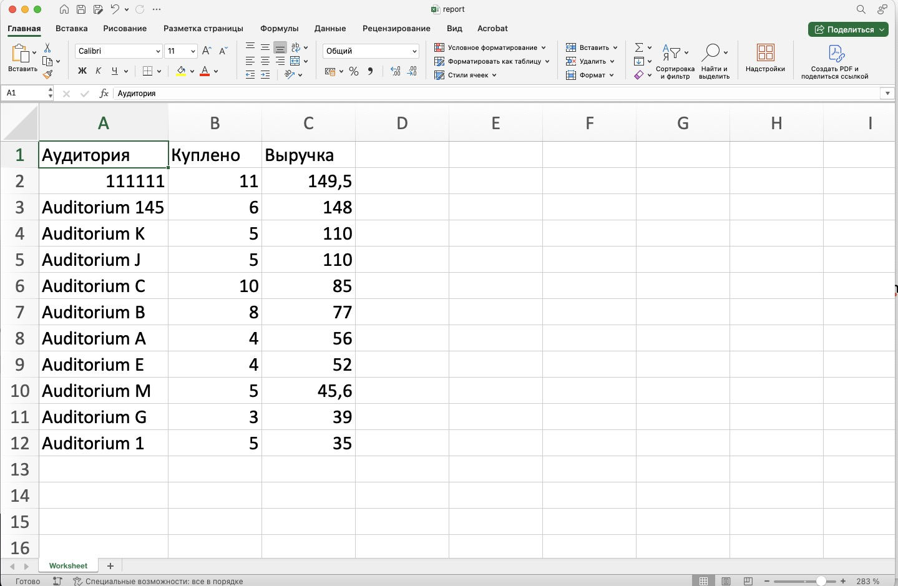

```php
$spreadsheet = new Spreadsheet();
$sheet = $spreadsheet->getActiveSheet();
$sheet->fromArray(array_keys($report[0]), null, 'A1');
$sheet->fromArray($report, null, 'A2');

header('Content-Type: application/vnd.openxmlformats-officedocument.spreadsheetml.sheet');
header("Content-Disposition: attachment;filename=\"report.xlsx\"");
(new Xlsx($spreadsheet))->save('php://output');
```

#### 📄 Экспорт в Word:

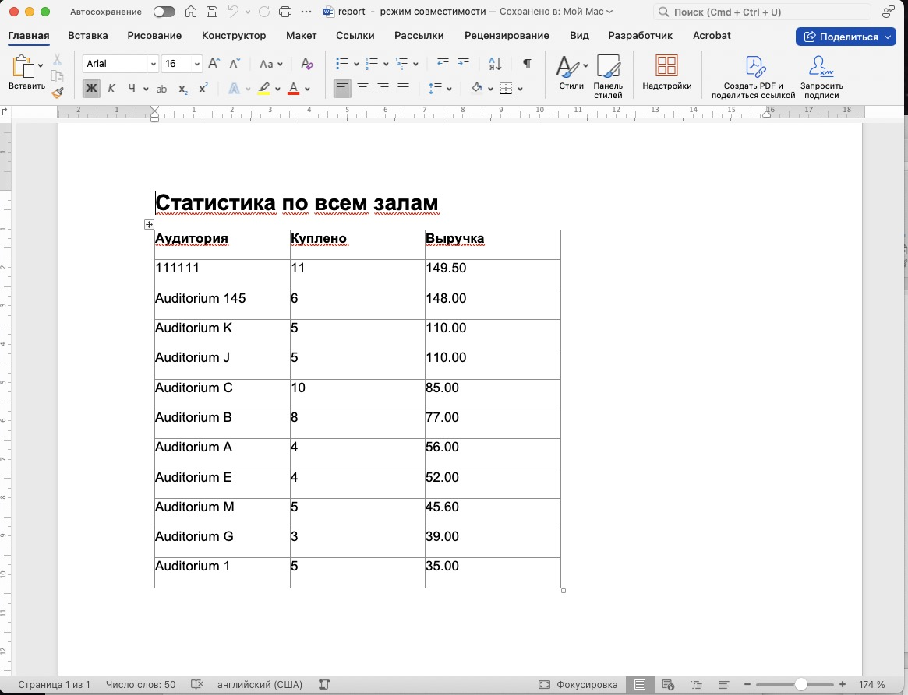

```php
$word = new PhpWord();
$section = $word->addSection();
$section->addText($title, ['bold' => true, 'size' => 16]);

$table = $section->addTable(['borderSize' => 6]);
$table->addRow();
foreach (array_keys($report[0]) as $col) {
    $table->addCell(2000)->addText($col, ['bold' => true]);
}

foreach ($report as $row) {
    $table->addRow();
    foreach ($row as $val) {
        $table->addCell(2000)->addText($val);
    }
}

header('Content-Type: application/vnd.openxmlformats-officedocument.wordprocessingml.document');
header("Content-Disposition: attachment;filename=\"report.docx\"");
IOFactory::createWriter($word, 'Word2007')->save('php://output');
```

--- 